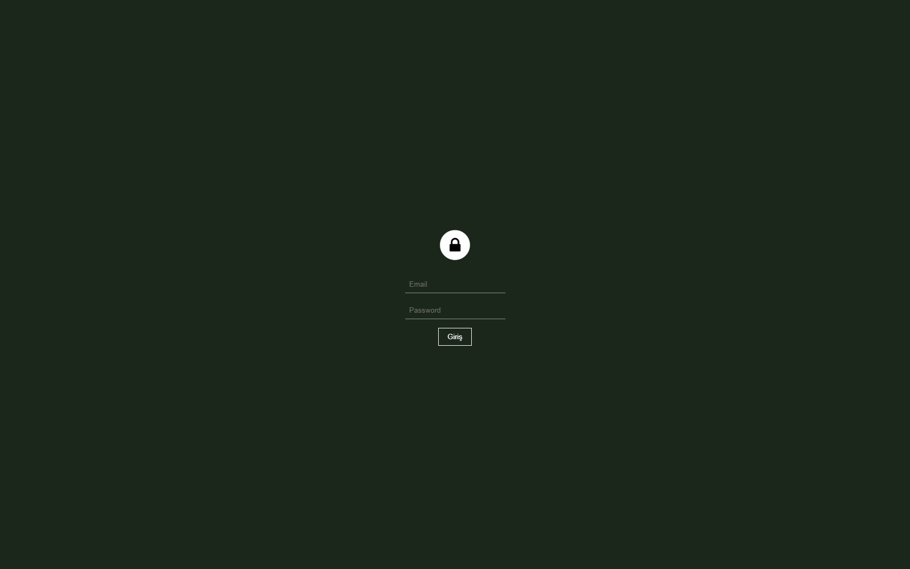
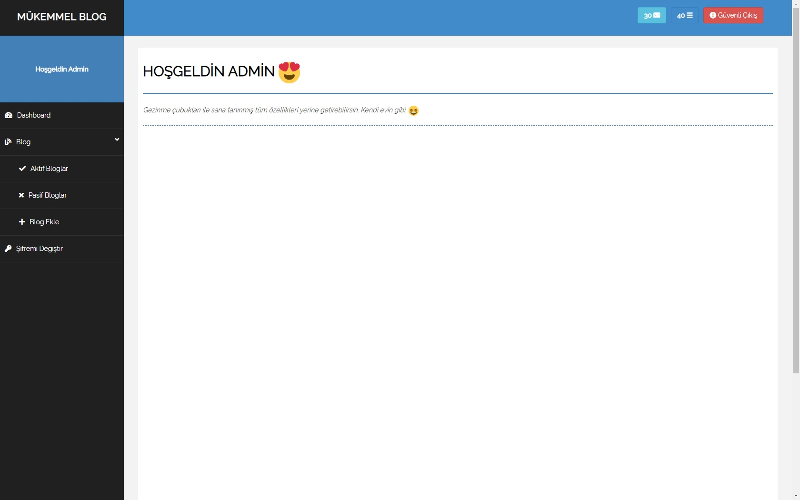
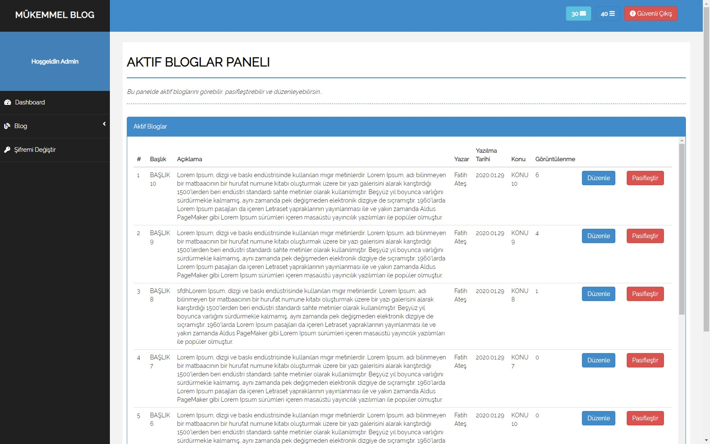
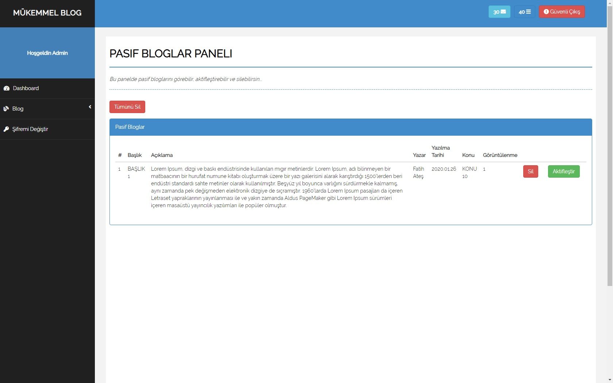
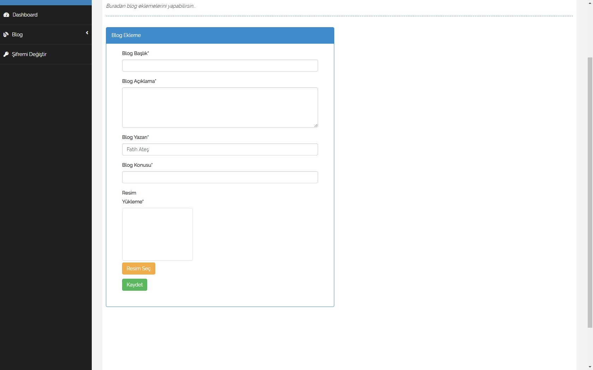

##  AÇIKLAMA

&emsp;&emsp;Next.js ile sıfırdan bir blog geliştirme yarışması için hazırladığım bir blog prototipi. 
> Mysql sağlayıcısı: https://remotemysql.com/
> Domain sağlayıcısı: https://www.heroku.com/
> Link:https://mukemmellblog.herokuapp.com/blog

##  ADMİN PANELİ

&emsp;&emsp;Admin panelinin şifresini direkt olarak açık yazmak pek mantıklı gelmedi kodlardan zaten anlayacağınızdan şüphem yok bunlar da bazı görselleri;

### GİRİŞ EKRANI

 

### ANA EKRAN

 

 ### AKTİF BLOGLAR

 

 ### PASİF BLOGLAR

 

 ### BLOG EKLEME 

 
